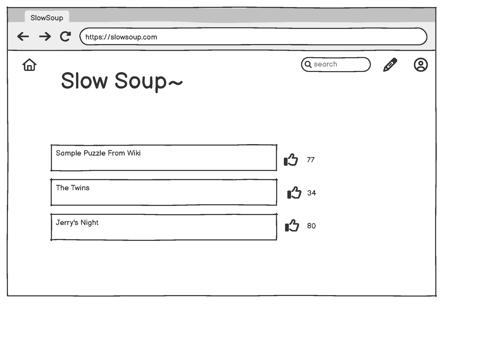
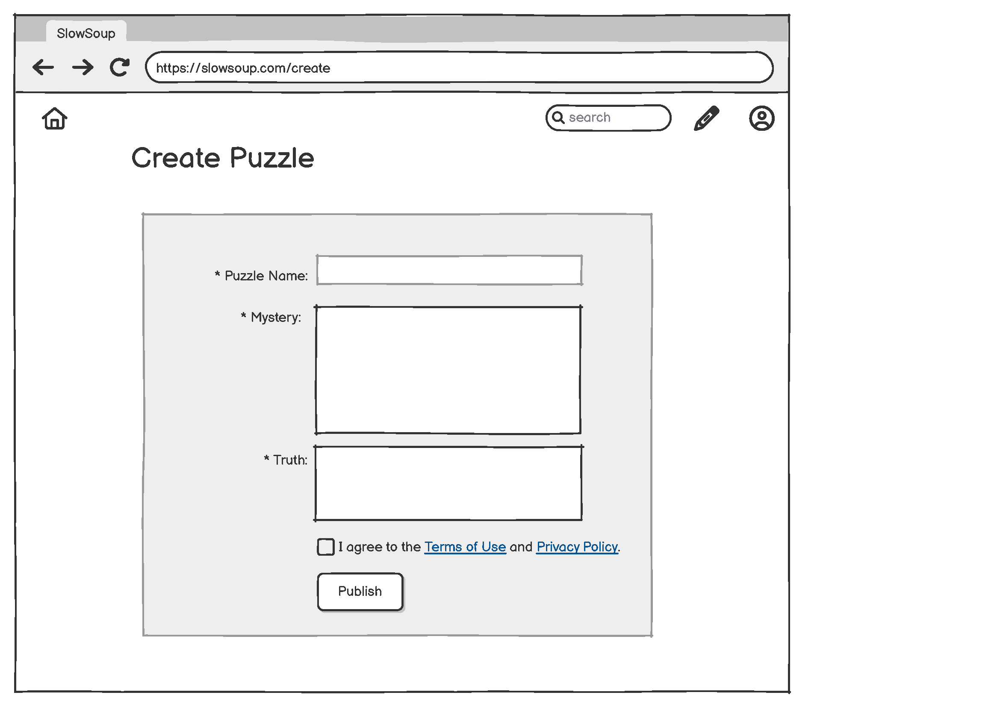
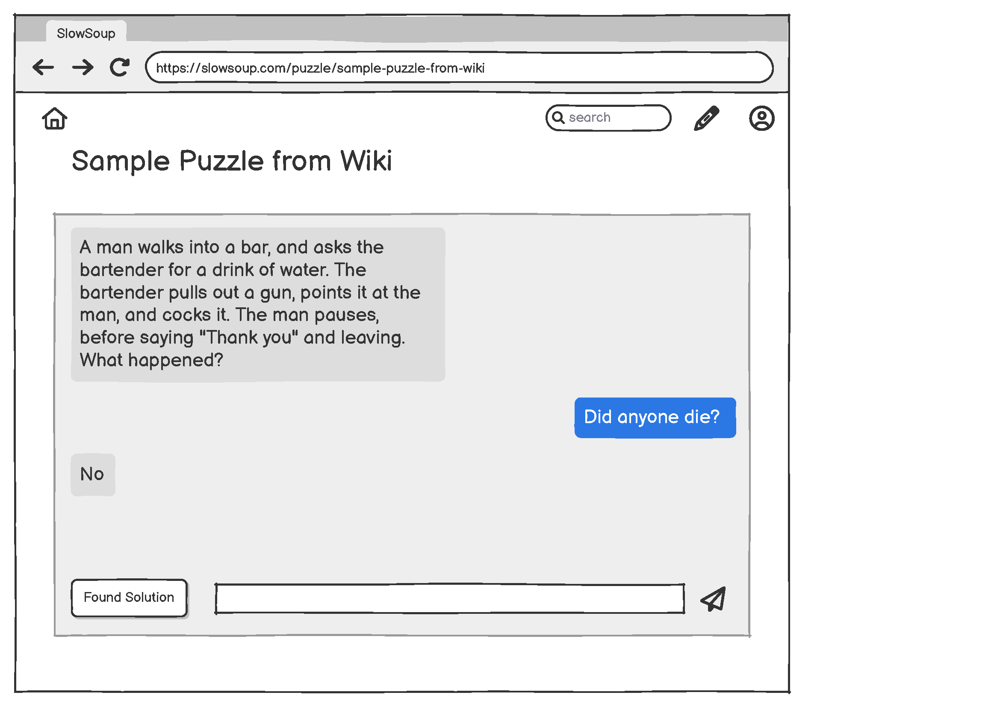
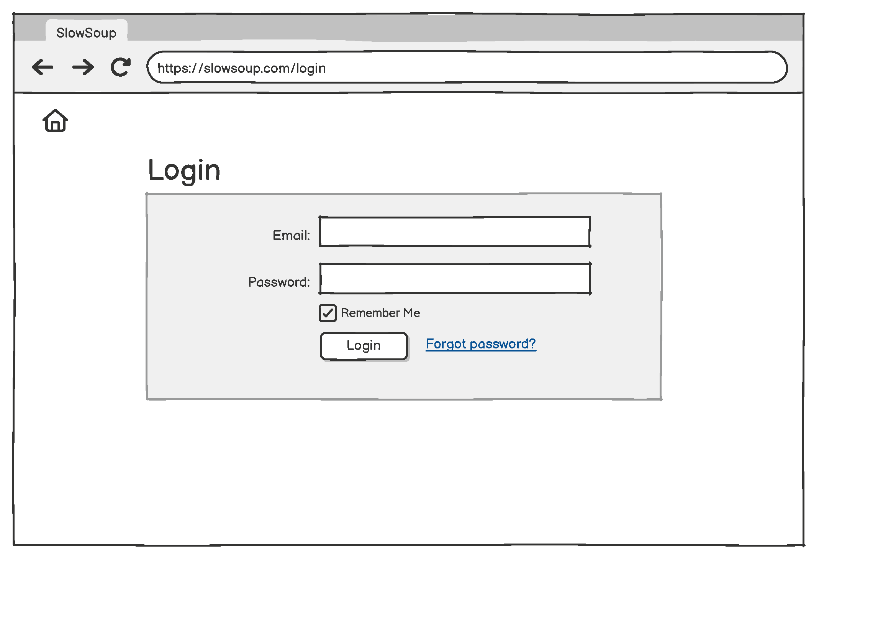
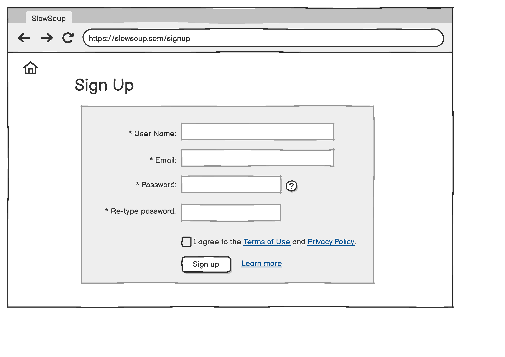
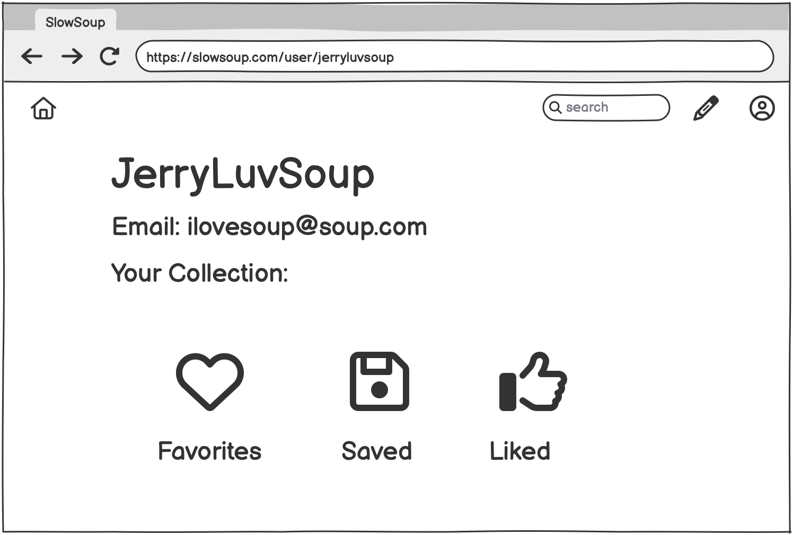
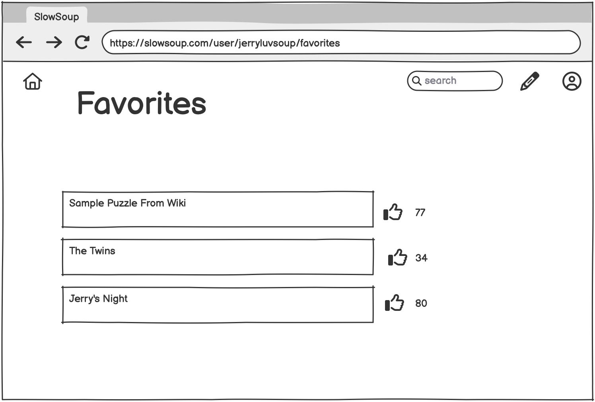
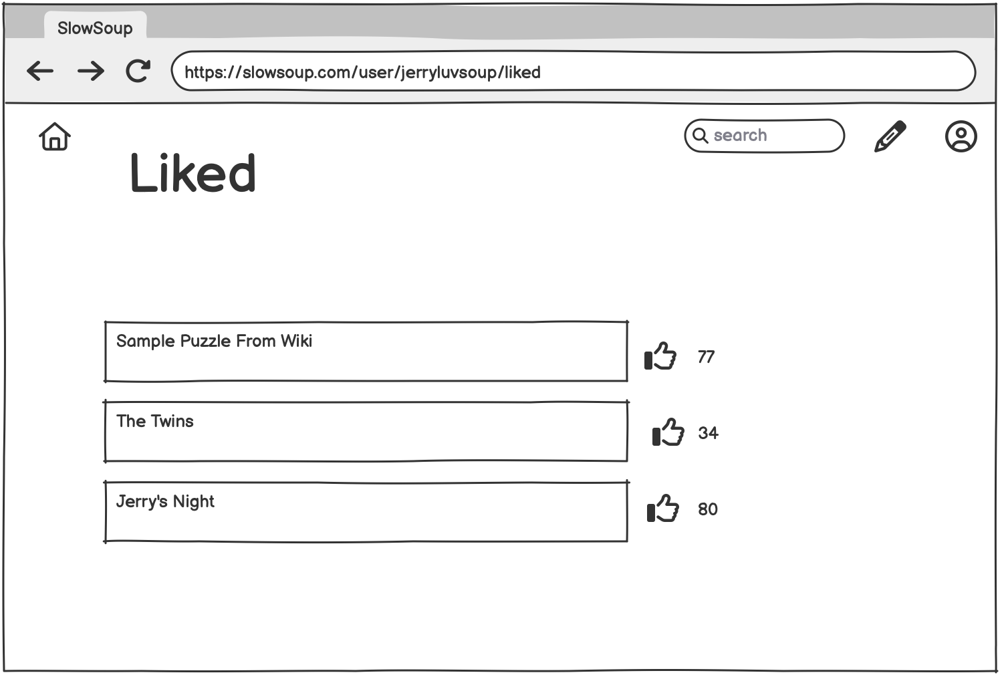
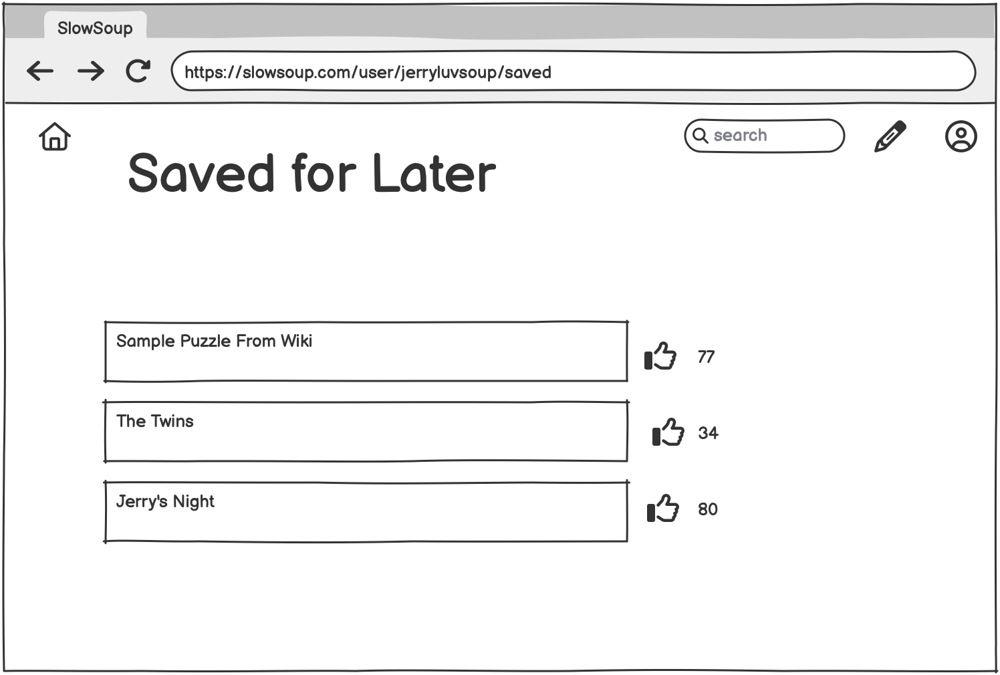
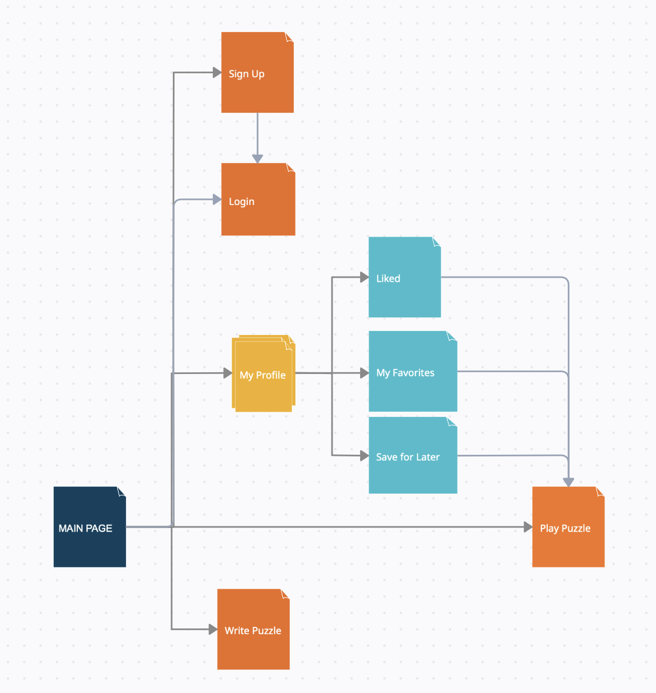

# Slow Soup

## Overview

**Situation Puzzles** is now becoming one of the most popular party games in China, but it is lack of modernized support. The game itself requires:
1. a pre-written plain-text puzzle consisted of
   1. a mystery
   2. a corresponding truth
2. player(s) that:
   1. ask yes/no question based on the mystery
   2. guess the solution based on known information
3. a judge that
   1. answer question by: yes/no/irrelevent
   2. compare the solution to the truth... end the game if the truth has been found

**Slow Soup** aim to provide a online platform for
1. puzzle writers to share their works to the world
2. player(s) to solve the shared puzzles by interacting with the AI judge supported by LLM


## Data Model


The application will store `User`, `Puzzle`, `PlayRecord`, `Liked`, `Saved`, `Favorites` 

All relations will be done via referencing. `Liked`, `Saved`, and `Favorites` will share the same schema called bookmark.

* `User`
* `Puzzle`
  * have reference(s) to User
  * `User` & `Puzzle`: One to Many
    * a `Puzzle` has one `User` as the author
    * a `User` may have 0 to many `Puzzle` as one's work
* `PlayRecord`
  * have reference to `User` and `Puzzle`
  * `PlayRecord` & (`Puzzle` + `User`): One to one
  * Record will be updated if `User` plays the same `Puzzle` again (instead of adding a new `PlayRecord`)
* bookmark (`Liked` / `Saved` / `Favorites`)
  * have reference to `User` and `Puzzle`
  * bookmark & (`Puzzle` + `User`): One to One
  * bookmark will be updated if modified by `User` (instead of adding a new bookmark)


An Example `User`:

```javascript
{
  username: "soupmaker",
  email: "ilovesoup@soup.com",
  hash: // a password hash,
}
```

An Example `Puzzle` with references to `User` (puzzle example retrieved from https://en.wikipedia.org/wiki/Situation_puzzle#Example):
```javascript
{
  title: "Example Puzzle From Wikepedia",
  mystery: 'A man walks into a bar, and asks the bartender for a drink of water. The bartender pulls out a gun, points it at the man, and cocks it. The man pauses, before saying "Thank you" and leaving. What happened?',
  truth: "The man had the hiccups, and his reason for requesting a drink of water was not to quench his thirst but to cure his hiccups. The bartender realized this and chose instead to cure the hiccups by frightening the man with the gun. Once the man realized that his hiccups were gone, he no longer needed a drink of water, gratefully thanked the bartender, and left.",
  author: // reference to User
  createdAt: // timestamp
}
```

An Example `PlayRecord` with references to `User` and `Puzzle`
``` javascript
{
  puzzle:  // reference to Puzzle,
  player:  // reference to User,
  attemptsUsed: 32,
  secondsUsed: 602,
  createdAt:  // timestamp,
}
```

An Example (`Favorites` / `Liked` / `Saved`) with references to `User` and `Puzzle`
``` javascript
{
  puzzle:  // reference to Puzzle,
  player:  // reference to User,
  createdAt: // timestamp,
}
```


## Link to Commented First Draft Schema

* [`User`](/backend/schemas/user.mjs) 
* [`Puzzle`](/backend/schemas/puzzle.mjs) 
* [`PlayRecord`](/backend/schemas/playRecord.mjs) 
* [`Liked`, `Favorites`, `Saved`](/backend/schemas/bookmark.mjs) 


## Wireframes

`/` - page for showing all shared puzzles




`/create` - page for creating and sharing a new puzzle




`/puzzle/:title` - page for playing specific puzzle




`/login` - page for login




`/signup` - page for login




`user/:username` - page for my profile



`user/:username/favorites` - page for viewing puzzles marked as favorites



`user/:username/liked` - page for viewing puzzles liked



`user/:username/saved` - page for viewing puzzles saved



## Site map



## User Stories or Use Cases

1. as non-registered user, I can register a new account with the site
2. as a user, I can log in to the site
3. as a user, I can create a new puzzle
4. as a user, I can view all of the puzzles
5. as a user, I can play any puzzle with the judge
6. as a user, I can like a puzzle
7. as a user, I can mark a puzzle as Favorites
8.  as a user, I can save a puzzle for later

## Research Topics

* (2 points) Test, compare, and decide the best LLM as the judge
  * prioritize the cost - free for decent amount of requests
  * capable of performing the required functionalities
  * https://github.com/cheahjs/free-llm-api-resources
* (4 points) Implement "the judge" using the API key of the selected LLM
    * enforce it's functionalities by prompt engineering
       1. answer and only answer by yes/no/irrelevent
       2. decide if the guessed solution is close enough to the truth
  * (optional) give content warning without giving away the answer
  * https://www.geeksforgeeks.org/create-working-chatbot-in-html-css-javascript/
* (4 points) Use passport.js to implement authentication
  * http://passportjs.org/docs
* (4 points) Perform email verification code
  * Incorperate into 
    * the sign up process
    * reset my password
  * https://www.geeksforgeeks.org/email-verification/
* (4 points) Perform plagerism check using the Grammarly API key
  * Prevent user from plagerising puzzles
  * avoid copyrights issues
  * https://developer.grammarly.com/plagiarism-detection-api.html


10 points total out of 8 required points (addtional points will __not__ count for extra credit)


## [Link to Initial Main Project File](/backend/app.mjs) 
ps: I want to start working on the frontend with react during the summer, so I used the `backend` & `frontend` folder structure. But `frontend` may be empty till the course ends...


## Annotations / References Used

1. [passport.js authentication docs](http://passportjs.org/docs) -> [auth.mjs](https://github.com/nyu-csci-ua-0467-001-002-spring-2025/final-project-deployment-JerryWu0316/blob/master/backend/routes/auth.mjs#L11&&L117), [app.mjs](https://github.com/nyu-csci-ua-0467-001-002-spring-2025/final-project-deployment-JerryWu0316/blob/master/backend/app.mjs#L28&&L34)
2. [connect-mongo npm docs](https://www.npmjs.com/package/connect-mongo) -> [app.mjs](https://github.com/nyu-csci-ua-0467-001-002-spring-2025/final-project-deployment-JerryWu0316/blob/master/backend/app.mjs#L32)
3. [adding adobe fonts to css](https://helpx.adobe.com/fonts/using/embed-codes.html) -> [layout.hbs](https://github.com/nyu-csci-ua-0467-001-002-spring-2025/final-project-deployment-JerryWu0316/blob/master/backend/views/layout.hbs#L6)
4. [color palette](https://coolors.co/palette/ccd5ae-e9edc9-fefae0-faedcd-d4a373) -> [color styling of views in general](https://github.com/nyu-csci-ua-0467-001-002-spring-2025/final-project-deployment-JerryWu0316/blob/master/backend/views/layout.hbs)
5. [Groq Documentation](https://www.reddit.com/r/reactjs/comments/twmild/autoresize_textarea_height_to_fit_the_content/) -> [groq.mjs](https://github.com/nyu-csci-ua-0467-001-002-spring-2025/final-project-deployment-JerryWu0316/blob/master/backend/groq.mjs#L1&&L122)


